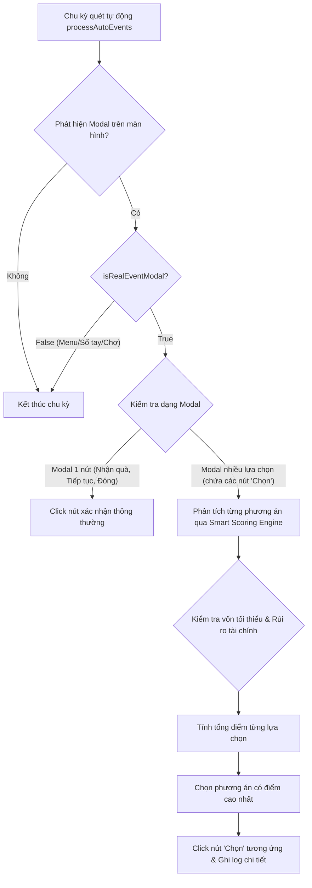

# Thiết Kế: Hệ Thống Phân Tích & Giải Quyết Sự Kiện Thông Minh (Smart Event Engine)

- **Ngày tạo:** 2026-10-07
- **Dự án:** Đế Chế Vỉa Hè Tool (`decheviahe_auto_invite.user.js`)
- **Tác giả:** Antigravity

---

## 1. Mục Tiêu & Bối Cảnh
Trong game "Đế Chế Vỉa Hè", người chơi thường xuyên gặp các sự kiện và tình huống ngẫu nhiên (Customer Dialogs / Encounters / Random Daily Events), ví dụ:
- Khách quen xin ghi sổ nợ (tiêu đề kiểu *"Anh Trung xin ghi sổ"*, với các phương án *"Cho ghi sổ"* hoặc *"Không bán chịu"*).
- Sự kiện kiểm tra đô thị, sự kiện thời tiết, người xin tiền, cơ hội buôn bán, v.v.

Mỗi phương án trong sự kiện có các thẻ nhãn tác động (`badges`/`tags`) như: `đưa 450k`, `hẹn 3 ngày`, `có khi mất`, `thân +`, `mất lòng`, `khách quen xa` và đi kèm nút hành động **"Chọn"**.

Hệ thống cũ chỉ nhận diện một số từ khóa tĩnh và nút "Tiếp tục" / "Nhận quà", dẫn đến việc bỏ sót hoặc không biết chọn phương án nào khi gặp sự kiện dạng này. Mục tiêu là phát triển **Smart Event Engine** có khả năng:
1. Nhận diện chuẩn xác mọi modal sự kiện / tình huống trong game mà không gây xung đột với các màn hình quản lý (Sổ tay, Chợ, Cửa hàng...).
2. Phân tích nội dung và các tag đánh giá tác động để chấm điểm lợi ích/rủi ro.
3. Tự động ra quyết định chọn phương án tối ưu dựa trên số vốn hiện có và chiến lược người chơi đã chọn.

---

## 2. Kiến Trúc & Luồng Xử Lý



---

## 3. Quy Tắc & Thuật Toán Chấm Điểm (Smart Tag Scoring Engine)

### 3.1. Nhận diện Modal Sự Kiện (`isRealEventModal`)
- **Danh sách loại trừ tuyệt đối:**
  - `#journal-root`, `#books-root`, `#dcvh-modal`, `#dcvh-auto-btn`
  - Các phần tử thuộc menu: Sổ tay, Dân cư, Chợ, Cửa hàng, Nhân viên, Cài đặt, Mặt bằng.
- **Tiêu chí chấp nhận:**
  - Tiêu đề chứa từ khóa sự kiện: `sự kiện`, `tin tức`, `biến cố`, `bất ngờ`, `cơ hội`, `thời tiết`, `ghi sổ`, `bán chịu`, `kiểm tra`, `tổng kết`, `chúc mừng`, hoặc
  - Modal chứa từ 2 thẻ lựa chọn trở lên và mỗi thẻ có nút có chữ `"Chọn"`.

### 3.2. Thuật toán phân tích Tag & Chấm điểm
Với mỗi phương án (Option Card), engine trích xuất danh sách text từ các tag/badge:

1. **Kiểm tra An Toàn Vốn (Financial Safety Gate):**
   - Quét các tag chỉ số tiền chi: `đưa Xk`, `chi Xk`, `phạt Xk`, `mất Xk`.
   - Nếu `tiền mặt hiện tại - số tiền chi < minCashReserve`:
     - Trừ **500 điểm** (coi như không khả thi để bảo vệ vốn dự phòng).

2. **Cộng điểm tích cực (Positive Weights):**
   - **Tăng quan hệ:** `thân +`, `thân thiết`, `kết thân`, `tình cảm +` -> **+50 điểm**
   - **Tăng danh tiếng:** `danh tiếng +`, `uy tín +`, `tiếng thơm +` -> **+40 điểm**
   - **Tăng thu nhập / Khách:** `nhận ...k`, `thu ...k`, `tăng khách`, `khách +` -> **+30 điểm**
   - **Tag tích cực chung (màu xanh lá hoặc chứa `+`):** -> **+20 điểm**

3. **Trừ điểm tiêu cực (Negative Weights):**
   - **Hỏng quan hệ:** `mất lòng`, `khách quen xa`, `thân -`, `giảm thân` -> **-40 điểm**
   - **Mất danh tiếng:** `danh tiếng -`, `mất uy tín`, `bị chê` -> **-35 điểm**
   - **Rủi ro mất trắng:** `có khi mất`, `nguy cơ`, `rủi ro` -> **-15 điểm** (khi vốn đủ thì chấp nhận rủi ro này để lấy thân thiết).
   - **Tag tiêu cực chung (màu đỏ hoặc chứa `-`):** -> **-20 điểm**

4. **Ưu tiên hòa:**
   - Nếu các phương án bằng điểm nhau, mặc định ưu tiên phương án 1 (Option đầu tiên).

---

## 4. Tùy Chọn Cấu Hình (Configuration & UI)

### 4.1. Thêm cấu hình trong `userConfig`:
```javascript
eventChoiceStrategy: 'smart', // 'smart' | 'safe' | 'first' | 'manual'
```
- `'smart'`: Phân tích điểm thông minh như mục 3 (Mặc định).
- `'safe'`: Ưu tiên an toàn tuyệt đối (tránh mọi rủi ro tiền tệ, chọn phương án từ chối).
- `'first'`: Luôn chọn phương án đầu tiên.
- `'manual'`: Bỏ qua các sự kiện có nhiều lựa chọn, chỉ giải quyết sự kiện 1 nút.

### 4.2. Giao diện (UI Settings trong Modal Tool):
- Thêm hàng lựa chọn chiến lược sự kiện trong Tab Tự động:
  - Dropdown / Radio: Chiến lược sự kiện:
    - 🧠 Thông minh (Ưu tiên Quan hệ/Lợi ích khi đủ vốn)
    - 🛡️ An toàn (Tránh rủi ro/Mất tiền)
    - ⏩ Luôn chọn phương án 1
    - ✋ Thủ công (Tự chọn tay)

---

## 5. Kế Hoạch Kiểm Thử (Verification)
1. Kiểm tra không bấm nhầm vào các nút trong Sổ tay, Chợ, Kho hàng hay Modal quản lý mặt bằng.
2. Kiểm tra modal dạng "Anh Trung xin ghi sổ":
   - Khi Tiền mặt > Vốn tối thiểu + 450k: Tool tự động chọn *"Cho ghi sổ"* (ưu tiên thân +).
   - Khi Tiền mặt thấp: Tool tự động chọn *"Không bán chịu"*.
3. Kiểm tra các modal sự kiện 1 nút truyền thống ("Tiếp tục", "Nhận thưởng", "Đóng"): Vẫn hoạt động trơn tru.
